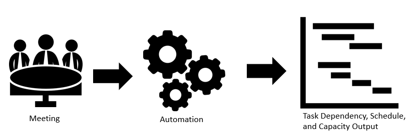
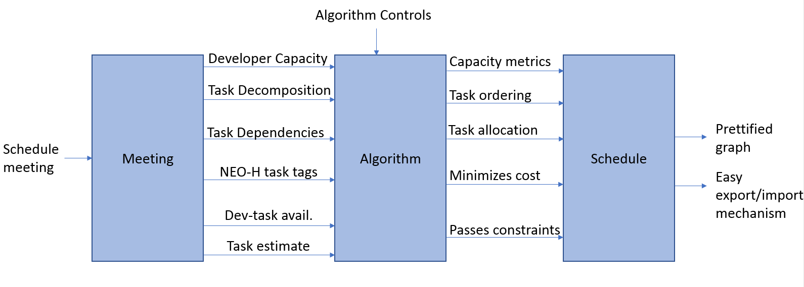

# agileManage
The goal is to automate the process completed after sprint planning. This involves dependency limitations, capacity allocation, and task ordering. I usually do this by hand, and an example can be found on DI2E Confluence. 

# Planning
## Objective

The key result I am looking for is after sprint planning, my time to schedule output is reduced from 1 working day to 1 hour. Additionally, if I have high cohesion and decoupled my code, I should be more flexible in the future for planning and can build on it. This gives me scalability. 

**Stage 2 = output of sprint goes into input of sprint retrospective to get metrics?
## Constraints
- Task transition cost – want a person working on a minimum number of tasks per sprint
- Task options (1 developer to 1 task)
- Good input – need to conduct a proper sprint planning meeting; garbage in, garbage out

## Components

### Meeting
- Input: Schedule meeting 
- Output: Developer capacity, task estimate, task decomposition, task dependencies, Need/External/Optional/High-priority (NEO-H) backup for each task, developer-task matching availability

### Automation
- Input: Meeting output
- Output: Solution for schedule: metrics (on capacity), task ordering, task allocation, minimizes cost, fits within constraints

### Schedule
- Input: Automation output
- Output: Prettified graph, easy export/import into management tools

## Diagram
 

## Algorithm Pseudo-Code
1. Get inputs 

- Meeting inputs: (Developer capacity, task estimate, task decomposition, task dependencies, Need/External/Optional/High-priority (NEO-H) backup for each task, developer-task matching availability)

- Algorithm control inputs

2. Determine capacity (developer/management split)

3. Assign required tasks to developers (tasks where only one person is optional to work on it)

4. Assign subsequent likely tasks (if developer is working on task ‘x’, they probably will also work on all tasks dependent on ‘x’)

5. Algorithm search for complete solution

- If no complete solution, loosen constraints (allow for marked, over

- Repeat until constraints are loosened too much. Return “recommendation: lengthen sprint or change sprint goal”

6. Outputs (Solution for schedule: metrics (on capacity), task ordering, task allocation, minimizes cost, fits within constraints)

## Algorithm Types
1. Random Search
2. (?) Approximation algorith/formal algorithm
3. Machine learning/gradient descent/objective function?

## Code Design 
### Objects
- Algorithm [has] algorithm controls (IE: Fibonacci task estimate where 2 points is about 1 day)
- Team member -> developer/manager [has] tasks, capacity
- Tasks [has] Task estimate, parent tasks, child tasks, NEO-H tags, assigned developer, dependent on, is depended by 

### Test Driven Development (TDD)
#### Introduction to TDD
I want to get better at test driven development: "Test-driven development (TDD) is a software development process that relies on the repetition of a very short development cycle: requirements are turned into very specific test cases, then the code is improved so that the tests pass" [wikipedia source](https://en.wikipedia.org/wiki/Test-driven_development). At the heart of it, we need to determine what is required, and then write tests that would pass if the requirements were met. 

1. Add a test
	-Setup: Put the Unit Under Test (UUT) or the overall test system in the state needed 	to run the test.

	- Execution: Trigger/drive the UUT to perform the target behavior and capture all 		output, such as return values and output parameters. This step is usually very simple.

	- Validation: Ensure the results of the test are correct. These results may include 		explicit outputs captured during execution or state changes in the UUT.

	- Cleanup: Restore the UUT or the overall test system to the pre-test state. This 		restoration permits another test to execute immediately after this one

2. Run all tests and see if the new test fails
3. Write the code
4. Run tests
5. Refactor code
6. Repeat

#### Specific Tests
I will have to create different tests based on the scope of what I am doing. The tests for the intermediate steps will be different from the tests for the entire program which depends on the completion of many of the intermediate steps. I want to run tests soon, so I will create some simple tests first.

First test ideas:
- Intake of meeting input (expected: all necessary variables are there)
- Can we create a team of people and a set of tasks?
- Check if dependency/child tasks can be traversed up/down
- Check algorithm points mapping and capacity (does mapping occur correctly? Do we aggregate capacity and determine leftover capacity correctly?)
- Does developer task matching work?
- Can we complete a solution (given easy problem?)

## Targeted Coding Skills

1. Test Driven Development

2. Python Classes